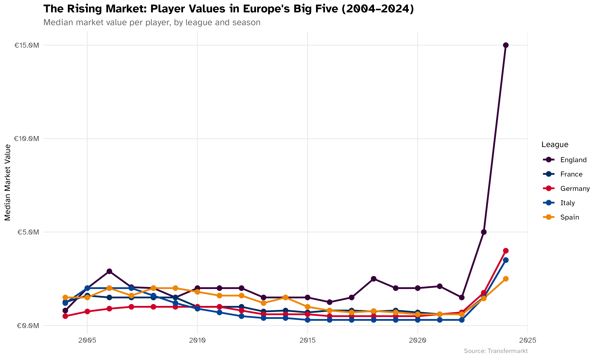
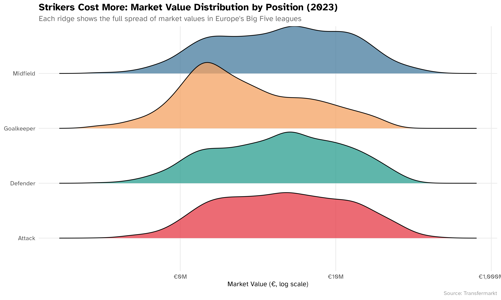
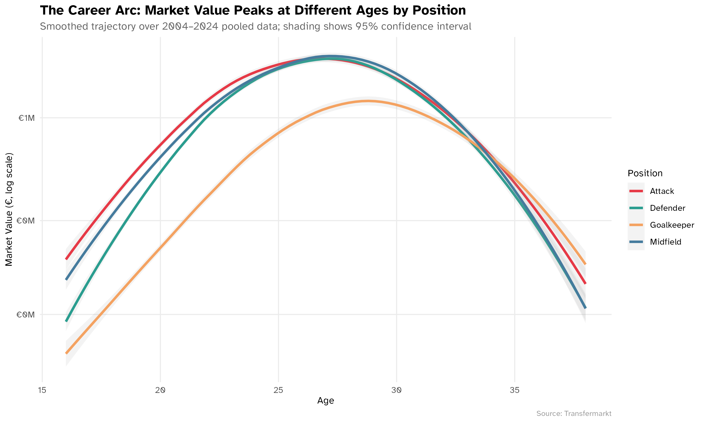
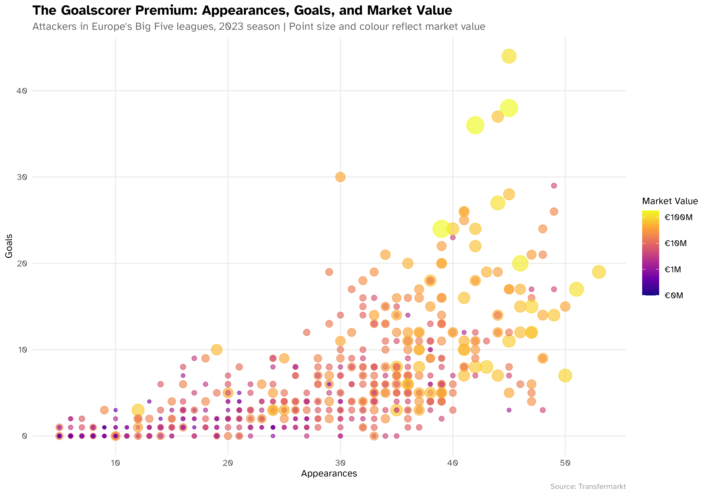
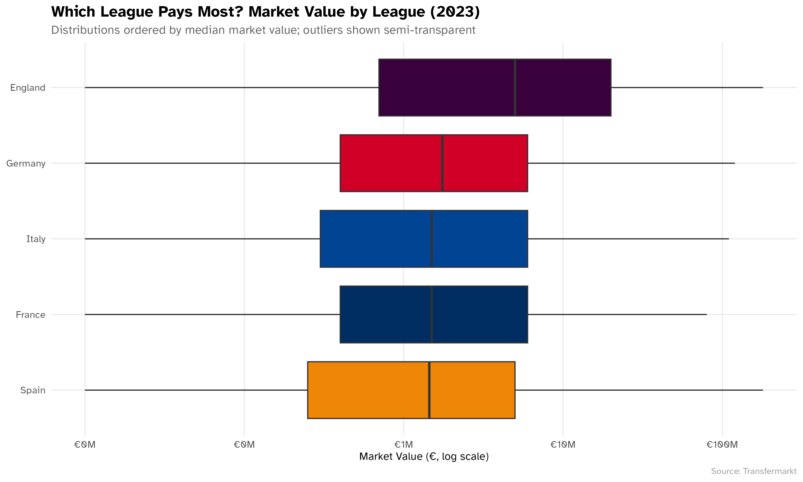

# What Makes a Footballer Valuable?

## Overview

This project analyses the determinants of player market value across Europe's Big Five football leagues (England, Spain, Italy, Germany, France) from 2004 to 2024. 
Employs a panel of over 100,000 player-season observations, the analysis explores how position, age, goal-scoring output, and league affiliation shape a player's market valuation. The project is implemented in R using RStudio.

## Structure

```
football-player-value/
├── README.md
├── .gitignore
├── R/                  # Reusable helper functions (theme, plotting utilities, data inspection)
├── scripts/
│   ├── 01_load.R       # Data loading and preparation
│   └── 02_analysis.R   # Full analysis — produces all five figures
├── output/             # Generated figures (PNG, 300 dpi)
└── data/               # Not included — see Data section below
```

Scripts are numbered in run order. `02_analysis.R` sources `01_load.R` automatically, so running the analysis script is sufficient to reproduce all outputs.

## Data

Data is not included in this repository.

The analysis uses `data/players_master.csv`, a panel dataset of professional football players drawn from [Transfermarkt](https://www.transfermarkt.com). Each row represents one player in one season and includes:

- **Identity**: player name, date of birth, nationality, club, league
- **Performance**: appearances, goals, assists, minutes played, cards
- **Market data**: market value (€), peak career market value (€)
- **Physical profile**: age, height, preferred foot, position, sub-position

The full dataset spans seasons from 1999 to 2025 and covers multiple European leagues. This project filters to the Big Five leagues (2004–2024 seasons) and rows with non-missing market values.

To reproduce the analysis, place `players_master.csv` in the `data/` directory and run `scripts/02_analysis.R`.

## Requirements

- **R** (≥ 4.2)
- **Packages**: `tidyverse`, `ggridges`, `scales`, `paletteer`
- **Optional font**: Atkinson Hyperlegible (used in figures; falls back to system default if unavailable)

Install all packages with:

```r
install.packages(c("tidyverse", "ggridges", "scales", "paletteer"))
```

## Usage

Set your working directory to the project root, then run:

```r
source("scripts/02_analysis.R")
```

This loads the data, applies all cleaning steps, and saves five figures to `output/`. Expected runtime is under two minutes on a standard laptop.

## Analysis Summary

The five figures produced tell a sequential story.

**1. The rising market (2004–2024)**

Median player market values have risen sharply across all five leagues since 2004, with growth accelerating after 2010.



**2. Value by position**

Attackers command the widest and highest value distributions; goalkeepers are the most compressed.



**3. The career arc**

Market value follows an inverted-U trajectory that peaks at different ages by position: attackers tend to peak in their mid-twenties, defenders and goalkeepers slightly later.



**4. The goalscorer premium**

Among attackers, high goal output relative to appearances is a strong marker of elevated market value.



**5. League comparison**

The Premier League consistently hosts the highest-valued players; differences across leagues are material even within the same position.


